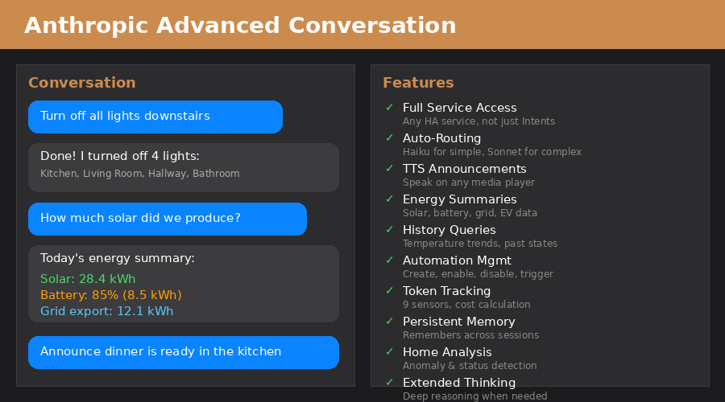

# Anthropic Advanced Conversation

[](https://github.com/hacs/integration)
[](https://github.com/WiesiDeluxe/anthropic_advanced/releases)
[](LICENSE)

<p align="center">
  
</p>

A custom Home Assistant integration that provides **Claude as a conversation agent with FULL access to all Home Assistant services** — not limited to the Assist/Intents API like the native Anthropic integration.

## Why this integration?

The official Home Assistant Anthropic integration limits Claude to the Assist API, which only supports basic device control via Intents. This integration gives Claude **unrestricted access** to all HA services, enabling:

- 🔊 **TTS announcements** on any media player
- 📜 **Script execution** and input helper manipulation
- 📊 **History queries** ("What was the temperature last night?")
- ⚡ **Energy summaries** (solar, battery, grid, EV charging)
- 🤖 **Automation management** (list, enable, disable, trigger, create)
- 🎨 **Dashboard card generation** as YAML
- 🔍 **Dynamic entity search** across your entire setup
- 🧠 **Persistent memory** — remembers preferences across sessions
- 📈 **Token usage tracking** — 9 sensors with cost calculation
- 🔔 **Proactive home analysis** — anomaly and status detection

## Feature Comparison

| Feature | Native Anthropic | **Anthropic Advanced** |
|---|---|---|
| Conversation Agent | ✅ | ✅ |
| Light/Switch/Cover Control | ✅ (via Intents) | ✅ (via Services) |
| **TTS Announcements** | ❌ | ✅ `tts.speak` |
| **Run Scripts** | ❌ | ✅ |
| **Set Input Helpers** | ❌ | ✅ |
| **Manage Automations** | ❌ | ✅ |
| **Query History** | ❌ | ✅ |
| **Energy Summary** | ❌ | ✅ |
| **Generate Dashboard Cards** | ❌ | ✅ |
| **Dynamic Entity Search** | ❌ | ✅ |
| **Auto-Routing (fast/smart model)** | ❌ | ✅ |
| **Conversation History Management** | basic | ✅ token-budgeted + compression |
| **Token Usage Tracking** | ❌ | ✅ 9 diagnostic sensors |
| **Persistent Memory** | ❌ | ✅ cross-session |
| **Proactive Home Analysis** | ❌ | ✅ anomaly detection |
| Jinja2 System Prompt | ✅ | ✅ |
| Extended Thinking | ✅ | ✅ |
| UI Configuration | ✅ | ✅ |

## Installation

### HACS (recommended)

1. HACS → Integrations → Three-dot menu → **Custom Repositories**
2. URL: `https://github.com/WiesiDeluxe/anthropic_advanced`
3. Category: **Integration**
4. Click **Install** → Restart Home Assistant

### Manual

1. Copy `custom_components/anthropic_advanced/` to your `config/custom_components/` directory
2. Restart Home Assistant

## Configuration

1. **Settings → Devices & Services → Add Integration**
2. Search for **"Anthropic Advanced Conversation"**
3. Enter your [Anthropic API Key](https://console.anthropic.com/settings/keys)
4. Configure options (model, prompt, temperature, etc.)
5. **Settings → Voice Assistants** → Select **"Anthropic Advanced"** as conversation agent

## Options

| Option | Default | Description |
|---|---|---|
| Auto-Routing | ✅ enabled | Uses a fast model (Haiku) for simple commands, smart model (Sonnet) for complex queries |
| Complex Model | `claude-sonnet-4-5-20250929` | Model for analysis, explanations, multi-step reasoning |
| Fast Model | `claude-haiku-4-5-20251001` | Model for device control, simple queries |
| Max Tokens | 4096 | Maximum response tokens |
| Temperature | 0.7 | Response creativity (0.0 = deterministic, 1.0 = creative) |
| Max Tool Calls | 15 | Maximum tool invocations per conversation turn |
| Thinking Budget | 0 (disabled) | Extended thinking tokens (min. 1024 to enable, Sonnet only) |
| Max History Messages | 20 | Messages kept per conversation |
| Max History Tokens | 12000 | Token budget for conversation history |
| System Prompt | (see below) | Jinja2-enabled system prompt |

## System Prompt

The system prompt supports **Jinja2 templates** with access to all exposed entities:

```
You are a smart home assistant.
Current time: {{now().strftime('%A %d.%m.%Y %H:%M')}}.

Available devices:

{{entity.entity_id}}|{{entity.name}}|{{entity.state}}

```

### Customization Tips

**TTS announcements** — Add your speaker mapping to the prompt:
```
For TTS, use: domain=tts service=speak entity_id=tts.home_assistant_cloud
  service_data: {media_player_entity_id: <target>, message: <text>}
Speakers: Living Room=media_player.sonos_living_room
          Kitchen=media_player.sonos_kitchen
```

**Room groups** — Define groups for multi-room commands:
```
Groups: "everywhere"→all speakers "downstairs"→living_room+kitchen+bathroom
```

**Language** — Set your preferred language:
```
Always respond in English. Be concise and helpful.
```

## Tools

### `execute_services`
Execute **any** Home Assistant service — the core of this integration:
- `tts.speak` — TTS announcements on any media player
- `light.turn_on` — Lights with brightness, color, transition
- `script.turn_on` — Run scripts
- `input_text.set_value` — Set helper values
- `climate.set_temperature` — HVAC control
- **Any HA service** — no restrictions

### `get_entity_state`
Read current state and attributes of any entity.

### `get_history`
Query state history (e.g., "Temperature trend over the last 24h").

### `search_entities`
Find entities by name, domain, or area.

### `get_energy_summary`
Energy data overview (solar production, battery, grid, EV charging).

### `manage_automation`
List, enable, disable, trigger, or create automations.

### `generate_dashboard_card`
Generate dashboard cards as YAML output.

### `memory` *(v1.1.0)*
Persistent memory tool for saving and recalling user preferences:
- **save** — Store a key-value pair (e.g., "Office light preference: 60%")
- **get** — Retrieve a saved value
- **list** — Show all saved memories
- **delete** — Remove a memory

Data persists across restarts in `.anthropic_memory.json`.

### `analyze_home` *(v1.1.0)*
Proactive home analysis tool that scans all entities for:
- Unavailable/offline devices
- Temperature extremes (>35°C or <5°C indoors)
- Humidity issues (>80% or <20%)
- Low battery devices (<15%)
- Open doors, windows, or garage doors
- Lights left on (with brightness level)

## Token Usage Tracking *(v1.1.0)*

Nine diagnostic sensors track your API usage in real-time:

| Sensor | Description |
|---|---|
| `total_input_tokens` | Cumulative input tokens sent |
| `total_output_tokens` | Cumulative output tokens received |
| `total_cost` | Running cost in USD |
| `total_requests` | Number of API calls |
| `total_tool_calls` | Number of tool invocations |
| `last_model` | Model used for last request |
| `last_input_tokens` | Input tokens for last request |
| `last_output_tokens` | Output tokens for last request |
| `last_cost` | Cost of last request |

Cost calculation uses official Anthropic pricing per model tier (Haiku/Sonnet/Opus).

## Services

### `anthropic_advanced.debug_history`
Shows conversation history statistics in Developer Tools → Services:
- Without parameters: Overview of all active conversations
- With `conversation_id`: Detailed breakdown

### `anthropic_advanced.clear_history`
Clear conversation history (all or specific conversation).

### `anthropic_advanced.reset_usage` *(v1.1.0)*
Manually reset token usage counters. Returns archived values before reset.

### `anthropic_advanced.analyze_home` *(v1.1.0)*
Run proactive home analysis as a service call. Returns JSON with anomalies, warnings, and info.

## Events *(v1.1.0)*

| Event | When | Data |
|---|---|---|
| `anthropic_advanced_usage` | After each API request | model, tokens, cost, tool_calls |
| `anthropic_advanced_daily_summary` | Midnight (auto-reset) | Yesterday's totals |

## How Auto-Routing Works

When enabled, the integration classifies each user message locally (no API call) as either **simple** or **complex**:

- **Simple** → Fast model (Haiku): Direct device control, TTS, temperature queries, time questions
- **Complex** → Smart model (Sonnet): Energy analysis, history queries, explanations, automation creation

This significantly reduces API costs and response latency for common commands.

## How History Management Works

The conversation history is managed with:

- **Tool compression**: Older tool call/result pairs are compressed into compact summaries, keeping the last 2 interactions intact
- **Token budgeting**: Messages are trimmed when exceeding the configured token budget
- **TTL cleanup**: Inactive conversations are automatically removed after 1 hour
- **Configurable limits**: Both message count and token budget can be adjusted in options

## Example Commands

- *"Announce in the kitchen: Dinner is ready"* → TTS via `tts.speak`
- *"What was the temperature last night?"* → History query
- *"How much solar did we produce today?"* → Energy summary
- *"Turn off all lights downstairs"* → Multi-service call
- *"Create an automation: Turn on lights at sunset"* → Generates YAML
- *"What devices are in the living room?"* → Entity search
- *"Remember: I prefer office lights at 60%"* → Saves to memory
- *"Is everything okay at home?"* → Proactive analysis

## Requirements

- Home Assistant 2025.12 or newer
- Anthropic API key ([get one here](https://console.anthropic.com/settings/keys))

## License

MIT License — see [LICENSE](LICENSE) for details.

## Contributing

Contributions are welcome! Please open an issue or pull request on [GitHub](https://github.com/WiesiDeluxe/anthropic_advanced).
